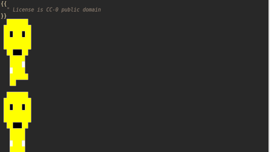

# Game creation framework for Vim inside Vim
[
## Why ?
Because we need another approach of working.

The origin of this pack is in the boring chronometer of the pomodoro technique.

I wanted a Vim-centered solution with a pinch of fun to make me stop working,
while others pomodoro applications was just another process to kill.

## Features
* Pixel art editor
* Sprites
* Template rendering
* Scheduled intrusion of random bots in your working session
